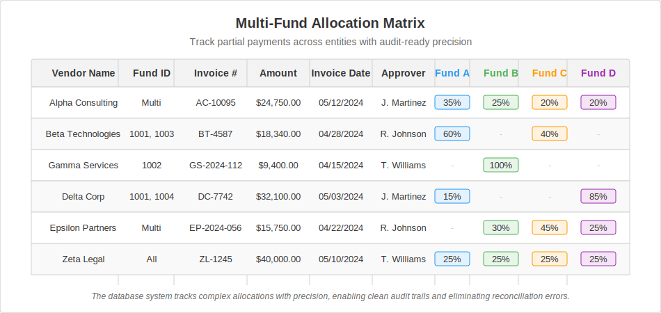

# 👋 Hi, I'm Christian Mukala

**Financial Systems Architect** | **Automation-First Accountant** | Python • Access • Excel • Power BI

I specialize in building backend infrastructure for finance, accounting, and treasury teams — especially where none exists. Whether it’s replacing spreadsheets, automating manual AP workflows, or building a lightweight ERP alternative in Microsoft Access, I deliver systems that save time, reduce risk, and scale.

---

## 🧠 What I Do

I’m not just doing accounting — I’m building financial operating systems from the ground up.

- 💼 **Manage fund accounting across 50+ legal entities and multiple bank platforms**, supporting private equity operations in a high-volume environment
- 🏗 **Designed an AP + treasury infrastructure from scratch** using Access, Excel, and Python to manage invoice approvals, fund allocations, vendor disbursements, and 1099/W-9 audit compliance
- 🧠 Reverse-engineered finance ops in a firm with no ERP or automation and delivered **fully auditable, scalable workflows**
- 📊 Created dashboards, reports, and reconciliation frameworks that support $330M+ in assets and monthly/quarterly closings
- 🔁 Collaborated across fund admins, compliance, and execs — transforming broken manual processes into standardized flows with logic, not bloat

---

## 🚀 Featured Projects

### 🔗 [Bank Statement Automation System](https://github.com/Christian-Mukala/Bank-Statement-Automation-System)  
Python automation tool for reconciling multi-bank statement exports.  
Converts Excel/PDF files into structured, rule-coded outputs — reducing manual reconciliation time by over **90%**.

- Handles inconsistent file formats from 4+ financial institutions  
- Applies rule-based logic for transaction classification  
- Outputs audit-ready, reconciled statements  
- Replaced a process that took **2 hours/day at the start of each month** with a system that now takes **~20 minutes total** (5 minutes per bank)  
- Eliminated formatting errors, improved traceability, and freed up over **16+ hours/month**

🧠 Tech: Python, pandas, openpyxl, OCR (future module)

---

### 🔗 [Private Equity AP + Treasury Database](https://github.com/Christian-Mukala/Private-Equity-AP-Treasury-Database)  
Microsoft Access database powering accounts payable, vendor management, fund allocation, and audit tracking for 50+ entities across multiple funds.

- Full relational schema linking invoices, payments, vendors, and fund allocations  
- Tracks **partial payments across multiple funds and vendors** with complete accuracy  
- Supports invoice splits, approval flows, vendor-to-fund mappings, and custom audit reports  
- Used actively for monthly closes, fund audits, payment forecasting, and compliance reviews

#### 🧠 Fund Allocation Matrix Example

This system allows precise tracking of complex payment allocations across multiple entities — one of the most challenging aspects of multi-fund financial operations:

**Business Impact:**  
This allocation tracking eliminated manual reconciliation errors, supported multi-fund partial payments, and provided clear audit trails for expenses shared across entities.  
Finance teams gained immediate visibility into how expenses were distributed, improving **month-end close accuracy by 40%** and reducing **vendor payment investigations from 5–6 hours/week to under 30 minutes**.

🧠 Tech: Microsoft Access, VBA, SQL logic, structured forms

---

## 💼 Professional Experience Highlights

- **Accountant – Arctaris Impact Investors**  
  Built and managed multi-entity fund accounting workflows across 50+ legal entities and 4 banks. Led automation of AP and fund disbursement processes. Supported audits, 1099 compliance, and $330M in assets under management.

- **Financial Analyst – Elkus Manfredi Architects**  
  Partnered directly with the CFO, Vice President, and accounting team to improve internal reporting, automate forecasting, and streamline financial strategy. Delivered Deltek-integrated dashboards and played a critical role in monthly close and executive presentations.

- **Billing & Operations Coordinator – Converse / Nike**  
  Supported global AP operations for celebrity sponsorships and international designer relationships, including clients like Tyler, The Creator.  
  Ensured smooth onboarding, invoice setup, and issue resolution across multi-currency environments (EUR/USD) — with a focus on fixing broken workflows post-Coupa rollout and acting as the bridge between Converse finance and international vendors.

---

## 🧭 What I’m Looking For

I'm seeking roles where I can combine finance knowledge with system design and automation — ideally in environments that value clarity, speed, and structured workflows.

### Areas of interest:
- 🔧 **Financial Operations & AP Automation**
- 🏗 **ERP/Finance System Implementation**
- 💻 **Tech-forward Accounting in SaaS, Fintech, or Public Finance**
- 🧠 **Hybrid Finance / Data / Low-Code Ops Roles**

---

## 🛠 Tools & Stack

| Category        | Tools                                                             |
|----------------|-------------------------------------------------------------------|
| 🧮 Core         | Microsoft Access, Excel (Advanced), Power BI                     |
| 💾 Database     | PostgreSQL, Access SQL, Airtable                                 |
| 🔁 Automation   | Python (pandas, openpyxl), Power Automate, VBA                   |
| 📈 ERP/Finance  | NetSuite, Deltek, Oracle EBS, Sage 300 CRE, Coupa, Aravo         |
| 📊 Reporting    | Power BI, Excel dashboards, Pivot Tables                         |
| 🔗 CRM/Support  | Salesforce, HubSpot                                              |

---

## 📫 Let’s Connect

- [LinkedIn](https://www.linkedin.com/in/Christian-mukala)  
- 📧 Email: Christianxm3@gmail.com  
- 📍 Based in Greater Boston | Open to hybrid or remote roles
